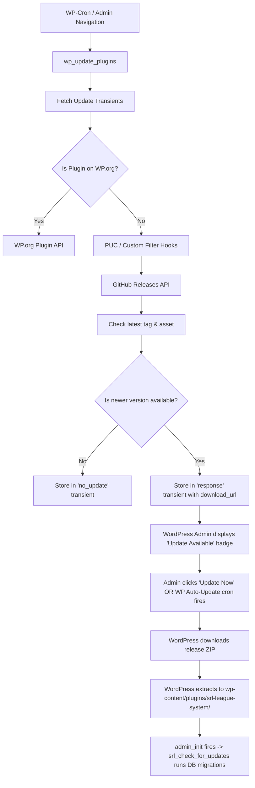
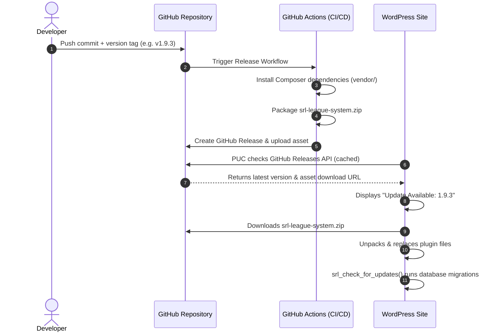

# Investigation & Architecture Guide: Automatic Update Flow for SRL League System

## Executive Summary

Custom WordPress plugins hosted outside the official WordPress.org repository (such as on GitHub) do not receive automatic updates by default. WordPress core update mechanisms rely on specific transient objects and filter hooks (`site_transient_update_plugins`, `plugins_api`, `upgrader_pre_download`).

For **SRL League System** (`srl-app`), setting up a seamless, robust, and automated update flow requires addressing three key architectural challenges:
1. **Monorepo Layout**: The repository `rafa2701/srl-app` contains both the plugin (`wp-content/plugins/srl-league-system`) and the theme (`wp-content/themes/srl-theme`). Raw GitHub ZIP archives cannot be installed directly by WordPress because WordPress requires the root folder of the ZIP to be `srl-league-system/`.
2. **Composer Dependencies**: The plugin relies on `phpoffice/phpspreadsheet` located in `vendor/`. Production WordPress sites should receive pre-built ZIP packages containing all dependencies so they don't need Composer on the server.
3. **In-Dashboard & Background Auto-Updates**: The site administrator should see native update notifications, changelogs, 1-click update buttons, and optionally have WordPress perform background auto-updates.

---

## 1. WordPress Plugin Update Architecture

WordPress checks for plugin updates periodically (via WP-Cron) using the internal function `wp_update_plugins()`.



### Key Hooks Involved:
- `pre_set_site_transient_update_plugins`: Injects the new version details (slug, new_version, package download URL) into WordPress's plugin update cache.
- `plugins_api`: Returns plugin metadata, changelogs, author info, and banner images when clicking "View version details".
- `auto_update_plugin`: Controls whether WordPress core should automatically update the plugin in the background without user intervention.
- `admin_init` / `plugins_loaded`: Runs post-update database schema migrations via `srl_check_for_updates()`.

---

## 2. Comparison of Update Approaches

| Approach | Description | Pros | Cons | Recommendation |
| :--- | :--- | :--- | :--- | :--- |
| **Approach 1: GitHub Releases + PUC (v5) + GitHub Actions** | GitHub Actions builds `srl-league-system.zip` with Composer dependencies upon Git tag. `plugin-update-checker` (PUC) checks GitHub Release assets and integrates with WP Core. | • Zero extra server cost<br>• Fully automated via Git tags<br>• Native WP Admin UI & 1-click update<br>• Supports private & public repos<br>• Handles transient caching & changelogs | Requires GitHub Actions setup and bundling PUC. | ⭐ **Strongly Recommended (Industry Standard)** |
| **Approach 2: Self-Hosted Metadata Server (JSON API / Cloudflare Worker / S3)** | A standalone API endpoint serves a JSON metadata file (`info.json`) pointing to hosted ZIP files. | • Total independence from GitHub API<br>• Custom licensing & token verification<br>• Analytics tracking | • Requires hosting & maintenance of an API endpoint and storage bucket. | Good for commercial / paid plugins with licensing systems. |
| **Approach 3: Git Updater Plugin (WP Plugin)** | Installing the third-party "Git Updater" plugin on the WordPress site to manage updates via Git headers. | • No custom updater code required in plugin | • Requires installing a separate plugin on every WordPress site<br>• Doesn't build Composer `vendor/` automatically unless configured. | Not self-contained. |
| **Approach 4: CI/CD Direct Deployment (SSH / SFTP / Webhook)** | GitHub Actions pushes code directly into the server's `wp-content/plugins/` directory over SSH/FTP. | • Instant update on `git push` without touching WP Admin | • Only works for single servers where you have SSH credentials<br>• Bypasses WordPress updater and multi-site distribution. | Best for full-site server deployments, not plugin distribution. |

---

## 3. Recommended Solution: GitHub Releases + PUC + GitHub Actions

### Architecture Overview



---

## 4. Implementation Blueprint (Step-by-Step)

### Step 1: Add Plugin Update Checker (PUC v5) to the Plugin

We integrate the battle-tested library `YahnisElsts/plugin-update-checker` (v5).

#### Option A: Via Composer (inside `wp-content/plugins/srl-league-system/composer.json`)
```json
{
    "require": {
        "phpoffice/phpspreadsheet": "^4.5",
        "yahnis-elsts/plugin-update-checker": "^5.4"
    }
}
```

#### Option B: Dedicated updater include (`includes/updater.php`)
Initialize PUC in the plugin bootstrap:

```php
<?php
/**
 * SRL Plugin Updater Setup
 * Location: wp-content/plugins/srl-league-system/includes/updater.php
 */

if ( ! defined( 'ABSPATH' ) ) exit;

use YahnisElsts\PluginUpdateChecker\v5\PucFactory;

function srl_init_plugin_updater() {
    // Path to the main plugin file
    $main_plugin_file = dirname( __DIR__ ) . '/srl-league-system.php';

    $update_checker = PucFactory::buildUpdateChecker(
        'https://github.com/rafa2701/srl-app/',
        $main_plugin_file,
        'srl-league-system'
    );

    // Tell PUC to look for release assets matching our zip file pattern
    $update_checker->getVcsApi()->enableReleaseAssets('/^srl-league-system.*\.zip$/');

    // Optional: If the GitHub repository is PRIVATE, supply an authentication token
    // You can define SRL_GITHUB_TOKEN in wp-config.php: define('SRL_GITHUB_TOKEN', 'ghp_xxx');
    if ( defined( 'SRL_GITHUB_TOKEN' ) && SRL_GITHUB_TOKEN ) {
        $update_checker->setAuthentication( SRL_GITHUB_TOKEN );
    }

    // Optional: Force auto-updates if desired
    // add_filter( 'auto_update_plugin', 'srl_enable_auto_updates', 10, 2 );
}
add_action( 'plugins_loaded', 'srl_init_plugin_updater' );
```

---

### Step 2: Create GitHub Actions Workflow for Automatic Packaging

Create `.github/workflows/release-plugin.yml` in the root of the repository:

```yaml
name: Build & Release SRL League System Plugin

on:
  push:
    tags:
      - 'v*.*.*' # Triggers on semantic version tags, e.g., v1.9.3

jobs:
  build-and-release:
    name: Package Plugin & Create Release
    runs-on: ubuntu-latest
    permissions:
      contents: write # Required to create releases and upload assets

    steps:
      - name: Checkout Repository
        uses: actions/checkout@v4

      - name: Setup PHP
        uses: shivammathur/setup-php@v2
        with:
          php-version: '8.1'
          extensions: mbstring, xml, ctype, iconv, intl, gd
          tools: composer:v2

      - name: Install Composer Dependencies
        working-directory: wp-content/plugins/srl-league-system
        run: |
          composer install --no-dev --prefer-dist --optimize-autoloader --no-interaction

      - name: Prepare Plugin Distribution Directory
        run: |
          # Create a staging directory with the exact plugin folder name
          mkdir -p build/srl-league-system
          
          # Copy plugin files (excluding development clutter, tests, git files)
          cp -r wp-content/plugins/srl-league-system/* build/srl-league-system/
          
          # Remove any temporary/unneeded files from distribution
          rm -rf build/srl-league-system/*.xlsx
          rm -rf build/srl-league-system/tests
          
          # Create the zip archive from inside the build directory
          cd build
          zip -r ../srl-league-system.zip srl-league-system/
          cd ..

      - name: Create GitHub Release & Upload Asset
        uses: softprops/action-gh-release@v2
        with:
          files: srl-league-system.zip
          generate_release_notes: true
          draft: false
          prerelease: false
        env:
          GITHUB_TOKEN: ${{ secrets.GITHUB_TOKEN }}
```

---

### Step 3: WordPress Core Background Auto-Updates (Optional)

If you want the WordPress site to update the plugin automatically in the background without needing the admin to manually click "Update", you can either:

1. Enable it directly from the WordPress Admin (`wp-admin/plugins.php` -> Click **"Enable auto-updates"** next to SRL League System).
2. Or add a code filter inside the plugin:

```php
/**
 * Automatically enable background updates for SRL League System
 */
add_filter( 'auto_update_plugin', function( $update, $item ) {
    if ( isset( $item->slug ) && $item->slug === 'srl-league-system' ) {
        return true; // Always auto-update this plugin
    }
    return $update;
}, 10, 2 );
```

---

### Step 4: Ensuring Smooth Database Migrations

When WordPress updates a plugin files in-place, `register_activation_hook` does **not** fire again.

The existing `srl_check_for_updates()` in `srl-league-system.php` already runs on `admin_init`:

```php
function srl_check_for_updates() {
    $installed_version = get_option( 'srl_league_system_version' );

    if ( $installed_version !== SRL_PLUGIN_VERSION ) {
        require_once SRL_PLUGIN_PATH . 'includes/db-setup.php';
        srl_create_database_tables();
        update_option( 'srl_league_system_version', SRL_PLUGIN_VERSION );
    }
    // ... DB adjustments and schema updates ...
}
add_action( 'admin_init', 'srl_check_for_updates' );
```

Whenever a new version is released:
1. The developer bumps `define( 'SRL_PLUGIN_VERSION', '1.9.3' );` and the plugin header `Version: 1.9.3`.
2. WordPress updates the files.
3. On the next admin page load, `srl_check_for_updates()` detects `$installed_version !== SRL_PLUGIN_VERSION`, runs `dbDelta()` / schema updates, and stores the new version in the options table.

---

## 5. Handling Private Repositories & Security

If the repository `rafa2701/srl-app` is **Public**:
- GitHub Releases and assets are publicly accessible.
- No tokens are required. PUC works immediately.

If the repository `rafa2701/srl-app` is **Private**:
- GitHub API requires an access token to download release assets.
- **Option 1 (wp-config.php constant)**:
  Generate a GitHub Personal Access Token (Fine-grained PAT with Read access to Contents & Releases or Classic PAT with `repo` scope).
  Add to `wp-config.php`:
  ```php
  define( 'SRL_GITHUB_TOKEN', 'ghp_yourPersonalAccessTokenHere' );
  ```
- **Option 2 (Plugin Settings Page)**:
  Add an input field in the "Gestión SRL" settings page where the admin can enter the GitHub Token, stored in `get_option('srl_github_token')`.

---

## 6. Developer Release Checklist

When you are ready to publish an update:

1. **Update Version Number**:
   - Update `Version: X.Y.Z` in `wp-content/plugins/srl-league-system/srl-league-system.php`.
   - Update `define( 'SRL_PLUGIN_VERSION', 'X.Y.Z' );`.
   - Update `README.md` badge and version section.
2. **Commit Changes**:
   ```bash
   git add .
   git commit -m "Bump version to 1.9.3: Add new features"
   ```
3. **Push Tag**:
   ```bash
   git tag v1.9.3
   git push origin master
   git push origin v1.9.3
   ```
4. **Automated Pipeline**:
   - GitHub Actions automatically executes the workflow, installs dependencies, compiles `srl-league-system.zip`, and creates a GitHub Release `v1.9.3`.
5. **WordPress Detection**:
   - Within 12 hours (or immediately upon clicking "Check for updates" in `wp-admin/update-core.php`), the WordPress site sees the update and updates automatically or with 1 click.

---

## 7. Next Steps & Implementation Roadmap

1. Add `yahnis-elsts/plugin-update-checker` to `srl-league-system` dependencies.
2. Create `includes/updater.php` and require it in `srl-league-system.php`.
3. Create `.github/workflows/release-plugin.yml` for automatic GitHub Release packaging.
4. Test the flow by tagging a test version and checking update detection on the WordPress admin dashboard.
